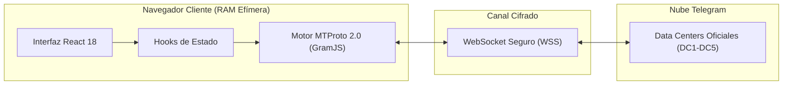

<div align="center">

# AetherGram

<p align="center">
  <strong>Client-Side MTProto Zero-Knowledge Extractor & Exporter</strong><br>
  Recupera historiales de chat, multimedia y datos de bots restringidos, canales censurados y cuentas eliminadas.
</p>

[](https://t.me/zsnow_7)
[](LICENSE)
[](https://react.dev)
[](https://vite.dev)
[](https://tailwindcss.com)
[](https://core.telegram.org/mtproto)

<br>

[Visión General](#-visión-general) • [Matriz Comparativa](#-matriz-comparativa) • [Arquitectura](#-arquitectura) • [Estructura del Proyecto](#-estructura-del-proyecto) • [Instalación](#-instalación) • [Seguridad](#-seguridad) • [Descargo Legal](#-descargo-legal) • [Autor](#-autor)

</div>

---

## ⚡ Visión General

Cuando Telegram restringe o bloquea un bot o canal por políticas de TOS locales o filtros de plataforma, los clientes oficiales de escritorio y móviles sustituyen las conversaciones por avisos de censura (*"Este canal no puede ser mostrado..."*).

**AetherGram** supera estas limitaciones de cliente estableciendo una conexión pura MTProto 2.0 en el navegador con credenciales oficiales Desktop (`API 2040`). Permite consultar directamente la capa de datos de Telegram mediante llamadas `messages.getHistory` y sesiones oficiales `Takeout`, exportando los mensajes íntegros sin intermediarios ni almacenamiento en disco.

---

## 📊 Matriz Comparativa

| Capacidad | Telegram Desktop Oficial | Telegram Web (K / A) | Este Extractor |
| :--- | :---: | :---: | :---: |
| **Acceso a Bots / Chats Restringidos** | ❌ Bloqueado en UI | ❌ Bloqueado en UI | <kbd>✔ Bypass MTProto Nativo</kbd> |
| **Persistencia de Sesión** | ❌ Guarda en Disco | ❌ Guarda en IndexedDB | <kbd>✔ Solo RAM (Zero-Knowledge)</kbd> |
| **Protocolo Oficial Takeout** | ✔ Solo en Desktop | ❌ No Disponible | <kbd>✔ Integrado en Navegador</kbd> |
| **Autenticación Dual Nativa** | ❌ Solo Código SMS | ✔ Solo QR | <kbd>✔ QR + Código en App</kbd> |
| **Visor HTML Standalone Interactivo** | ✔ Exportador Estándar | ❌ No Disponible | <kbd>✔ Dark Mode con Filtros</kbd> |
| **Volcado JSON con Metadatos ISO** | ✔ Estándar | ❌ No Disponible | <kbd>✔ Tipado Crudo Completo</kbd> |
| **Servidores Intermedios o Proxies** | ❌ Conexión Directa | ⚠️ Proxies Web | <kbd>✔ Conexión WSS Directa</kbd> |

---

## 🏛️ Arquitectura

La aplicación se comunica directamente con los Data Centers de Telegram a través de WebSockets seguros (`wss://`). No interviene ningún backend, servidor proxy ni base de datos externa:



---

## 📁 Estructura del Proyecto

El código está estructurado siguiendo el principio de **Responsabilidad Única (SRP)**:

```text
src/
├── config/
│   └── constants.js             # Credenciales Desktop (API 2040), límites y perfiles
├── core/                        # Motor MTProto puro (desacoplado de React)
│   ├── client.js                # Ciclo de vida y limpieza de TelegramClient en RAM
│   ├── auth/                    # Handshake QR, código en app y resolución 2FA
│   ├── dialogs/                 # Listado de diálogos, resolución InputPeer y entidades
│   └── extraction/              # Sesión Takeout, paginación por lotes y formateador
├── hooks/                       # Máquinas de estado reactivas (useTelegramAuth, useChatExtractor)
├── components/                  # Componentes atómicos con diseño Telegram Dark
│   ├── auth/                    # Modales de autenticación QR y código
│   ├── chat/                    # Selector de chats, filtros y acceso rápido
│   ├── extraction/              # Barras de progreso, estadísticas y descarga
│   └── common/                  # Header, footer y alertas
└── services/                    # Generadores de Visor HTML interactivo y Dump JSON
```

---

## 🚀 Instalación y Despliegue Local

### Requisitos Previos

* [Node.js](https://nodejs.org/) v18.0.0 o superior
* `npm`, `pnpm` o `yarn`

### Pasos

```bash
# 1. Clonar el repositorio
git clone https://github.com/zSnowww/AetherGram.git
cd AetherGram

# 2. Instalar dependencias
npm install

# 3. Iniciar entorno de desarrollo
npm run dev
```

La aplicación iniciará en `http://localhost:5173`.

### Compilación para Producción

```bash
npm run build
```

Genera un bundle estático optimizado en la carpeta `dist/`, listo para desplegar en GitHub Pages, Cloudflare Pages, Vercel o Netlify.

---

## 🔒 Modelo de Seguridad Zero-Knowledge

> [!IMPORTANT]
> **Garantía Zero-Knowledge:** La aplicación inicializa las sesiones mediante `new StringSession("")`. Las claves criptográficas y credenciales de autenticación residen exclusivamente en la memoria RAM volátil.

| Vector de Seguridad | Implementación | Garantía |
| :--- | :--- | :--- |
| **Persistencia de Claves** | Exclusivamente en memoria RAM | Se destruyen al cerrar la pestaña o recargar |
| **Almacenamiento Local** | Sin `localStorage` ni `Cookies` | Cero huella forense en el dispositivo |
| **Tráfico de Red** | TLS / WSS directo a Data Centers | Cero servidores intermediarios o telemetría |
| **Revocación de Sesión** | RPC `auth.LogOut` nativo | Cierra la sesión activa en Telegram en tiempo real |
| **Contraseña 2FA en la Nube** | Algoritmo SRP-6A client-side | El hash se calcula en local sin exponer la clave |

---

## ⚠️ Descargo Legal (Disclaimer)

> [!WARNING]
> Este software ha sido creado para **fines educativos, de portabilidad legítima de datos y auditoría de seguridad personal**.
> 
> * **Sin Afiliación:** Este proyecto es independiente y no está afiliado, respaldado ni patrocinado por Telegram FZ-LLC.
> * **Términos de Servicio:** El usuario es el único responsable del uso que dé a esta herramienta y del cumplimiento de los [Términos de Servicio de la API de Telegram](https://core.telegram.org/api/terms). Los autores no asumen responsabilidad alguna por suspensiones o medidas tomadas sobre cuentas de usuario por abuso de peticiones.

---

## 👤 Autor y Contacto

Desarrollado y mantenido por **zSnow**:

* **Telegram:** [@zsnow_7](https://t.me/zsnow_7)
* **GitHub:** [zSnowww/AetherGram](https://github.com/zSnowww/AetherGram)
* **Contacto Directo:** [](https://t.me/zsnow_7)

---

## 📄 Licencia

Este proyecto está distribuido bajo la licencia [MIT](LICENSE).

© 2026 zSnow.
